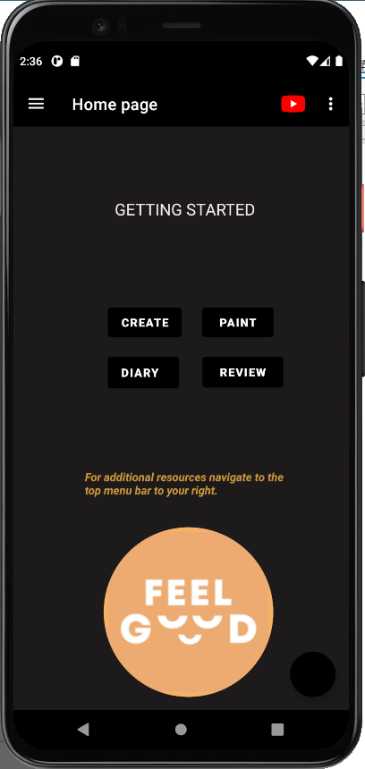

# FeelGood
###### by: Gireesh Sharma-Singh, Brett Kean, Supriya, Zhiyuan Hua and Eghe Iyobosa.
###### Depression is on the rise and will soon kill more people than heart disease.
###### Social media, email, messaging, apps, and now intelligent bots fight for our attention and feed addictions.
###### This is a journaling app which allows the user to process their emotions, both positive and negative is bound to inspire changes after each usage.
###### Following careful guidelines set out by our project Supervisor and project Team lead. The race to create a carefully planned App is underway.
###### Project milestone. Contract has been drawn and signed by all parties. This is found in the folder "docs".
###### The requirements for the App being developed is a Navigation Drawer, Target API 29 or 30 minimum API 23.
###### This application will support English and French.
###### With every Team based project there needs to be a way to keep track of all work being done. We keep track of our progress on Trello.
###### On Trello minimum of 5 stories split into 5 task. Db created on the Cloud.
# Project milestone. 
###### App is currently running smooth with a few warnings.
###### Proceeding with deliverable 3.
###### Final deliverable
# Bill of Materials
###### $25 usd one time payment for App Publishing.
# In-App
######     
